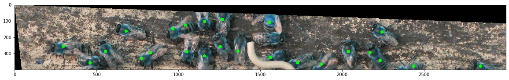
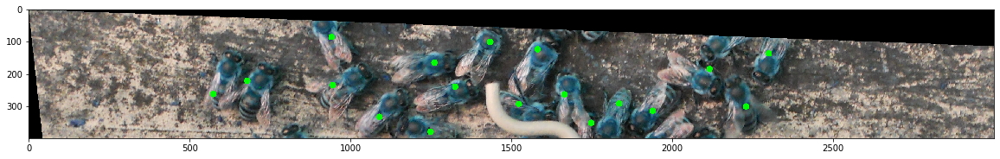
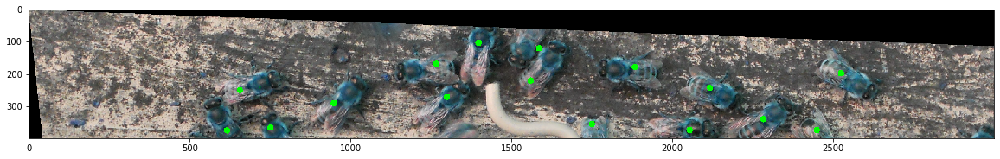
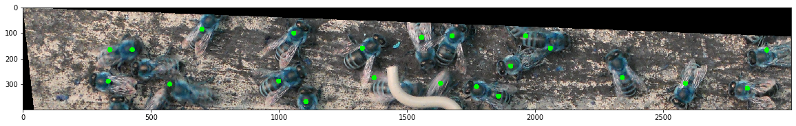
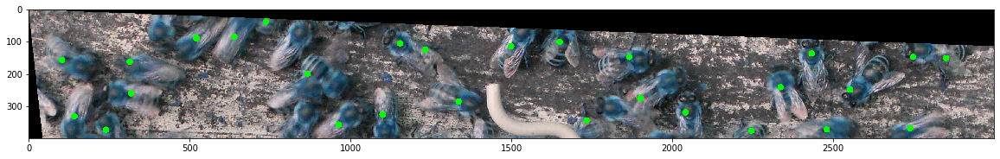

# BeeProcessor
A set of useful functions to process pictures of bees. The poistion output is used by a private project (traffic counting).

The NN model was only trained on a small set and outdated. Contact me if you are interested in a more refined version.

## Bee position estimation

Input image (BGR format expected) split into 200x200 pixel segments. Neural Network gives a 20x20 pixel prediction for each segment. These predictions then processed with OpenCV to get bees coordinates.

Check example for more detail on usage and expected inputs/outputs.

By the way, bees are blue because OpenCv loads image in a BGR format :)

